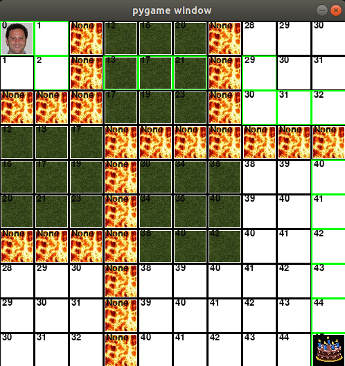
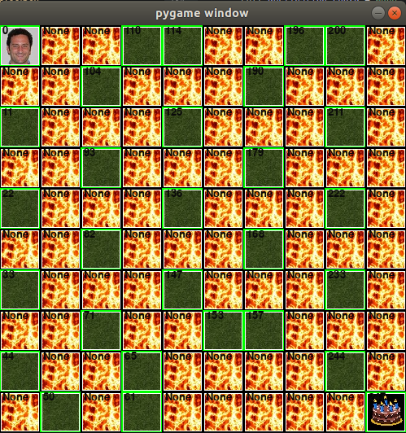
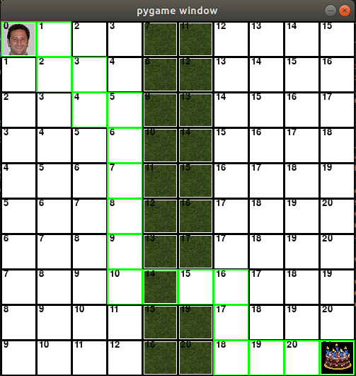

# ToolBox-AI

Al and Algorithms Project Toolbox starter code  
Instructions on [toolbox page](https://sd2020spring.github.io/toolboxes/algorithms-and-ai)  

- To get pygame **pip install pygame**
- Run **astar.py** to play, press 'l' and 's' to add lava and swamp.
- See **[this file](screenshot_explanations.md)** for more details.  

| example world      |  worst path         |  swamp crossing     |
|:------------------:|:-------------------:|:-------------------:|
|    |    |    |
