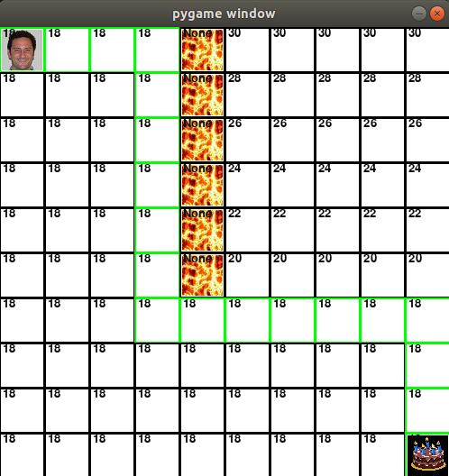
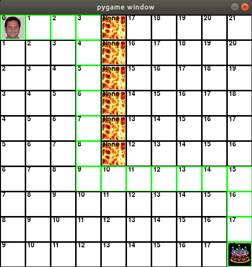
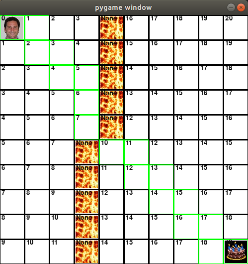
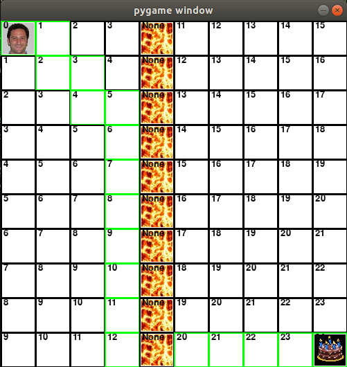

explain what f_score, g_score, and h_score are, and why you see those specific values in the screenshot.

You should be ready to explain why the shown path is actually the shortest (for instance… “the diagonal move while costly, is necessary in order to reach the goal, paths consisting of just up, down, left, or right would not be able to reach the goal”)."

Cost to draw:
f_cost                                              g_cost                                              h_cost
  
- f: This variable represents the score for that square, which is equivalent to g + h. Its' minimum on the board is equal to the cost of the shortest path.

- g: This variable represents the movement cost from the starting point to that square. I would describe it as the minimum number of steps (+ terrain cost if applicable) that it would take to get to a given square.

- h: This variable represents the estimated movement cost from that square to to the ending point. It is basically the reverse of g.

Features:
diagonal                                            jump                                                swamp
  
- diagonal: This path is an example where the actor is forced to move diagonally, adding 3 movement points and proving that the feature works.

- jump: This path is an example where the actor is forced to jump over lava, adding 8 movement points and proving that the feature works.

- swamp: This path is an example where the actor is forced to walk through a swamp, adding 3 movement points and proving that the feature works.

Challenge:

What is the worst path you can come up with? Mine had a cost of 247 movement points.
